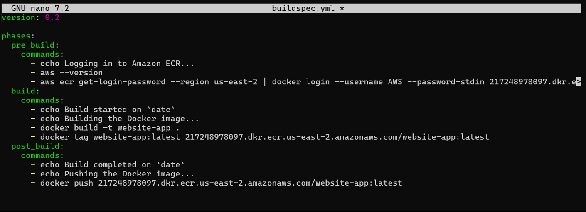
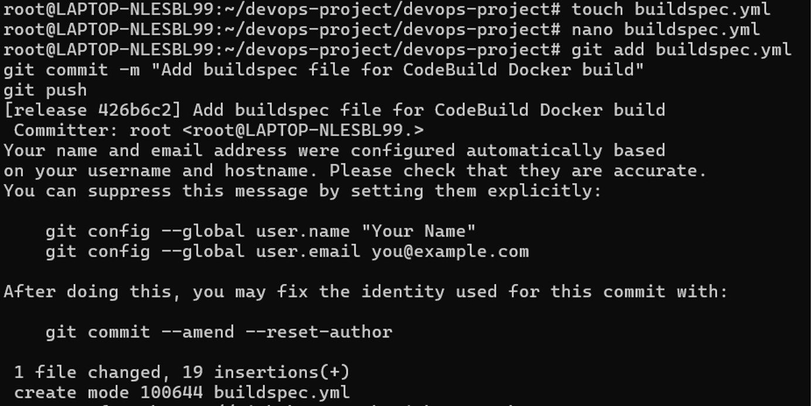
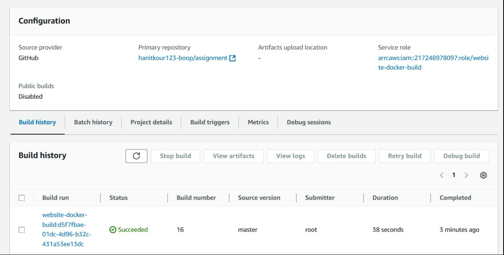

# AWS CodeBuild

AWS CodeBuild was used as the build automation component of the DevOps workflow.

## CodeBuild Configuration

The CodeBuild project was configured to work with the source repository and execute the required build process.

## Build Configuration

The build configuration was defined to automate the application build process.

## Build Execution

The CodeBuild build process was executed and its status was monitored through the AWS console.

