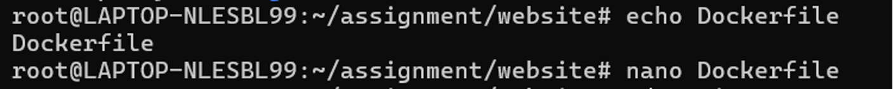
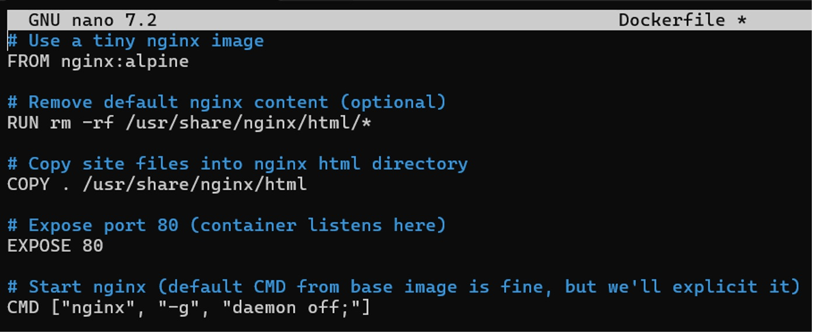
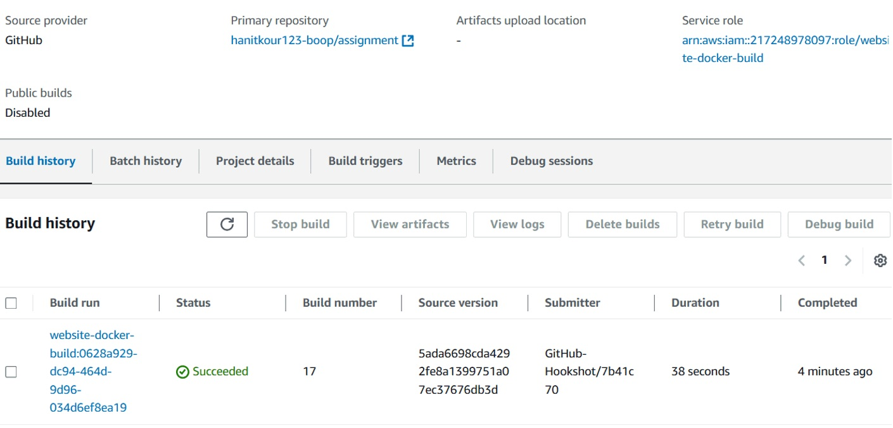
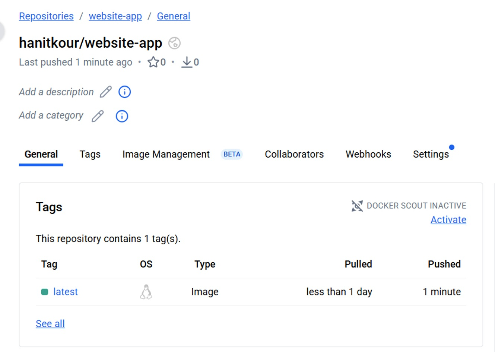
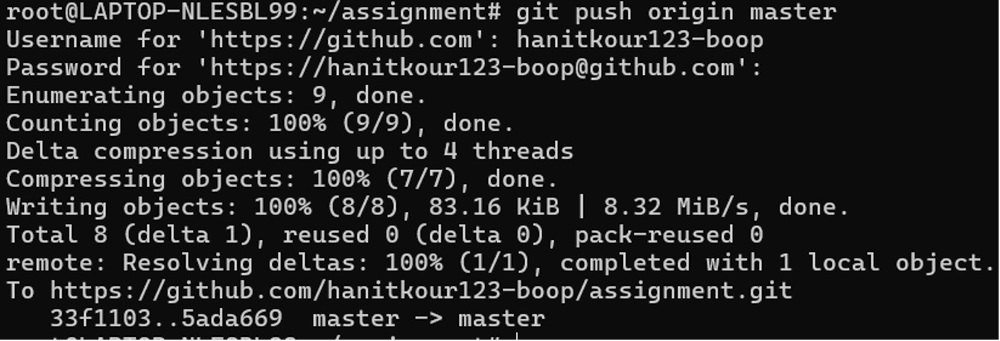

# Docker Containerization

Docker was used to containerize the application as part of the DevOps workflow.

## Dockerfile Creation

A Dockerfile was created to define the application image and its required configuration.

## Dockerfile Configuration

The Dockerfile was configured with the required instructions to build the application container image.

## Docker Image Build

The Docker image was built successfully using the Dockerfile.

## Docker Hub

The custom Docker image was pushed to Docker Hub for use in the deployment stage.

## Repository Push

The Docker-related changes were pushed to the remote Git repository.

