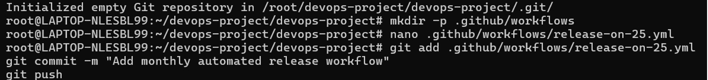
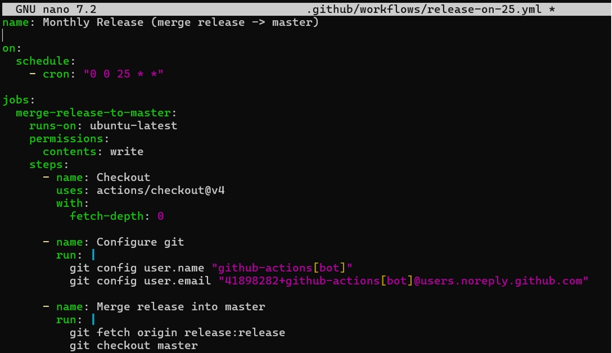
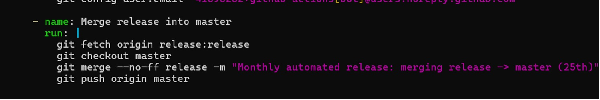
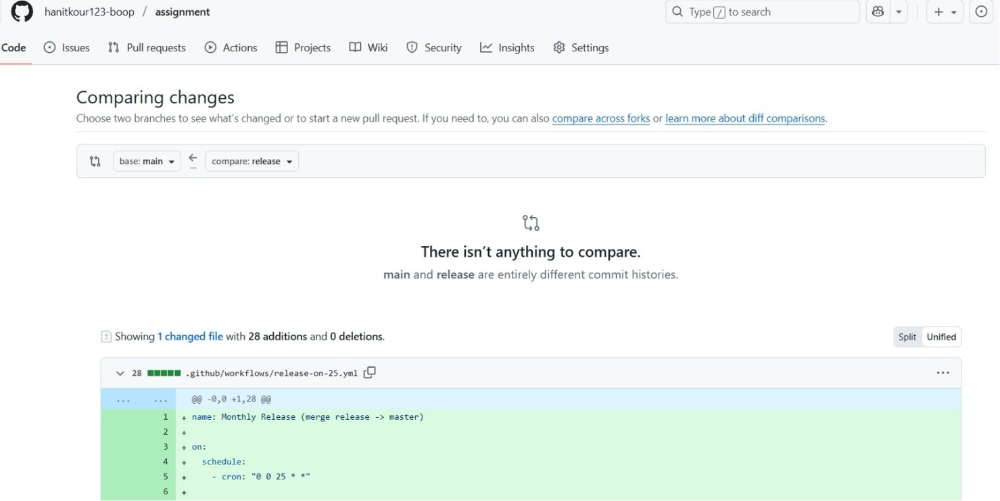

# Git & GitHub Workflow

This section demonstrates the Git and GitHub workflow used during the DevOps project.

## Release Workflow and Configuration

A GitHub Actions workflow file was created to define a monthly release schedule. The release workflow configuration was added to YAML file.

## Git Workflow

Git commands were used to fetch changes, merge updates, and push changes to the remote repository.

## GitHub Repository

The workflow file was pushed to the GitHub repository.

