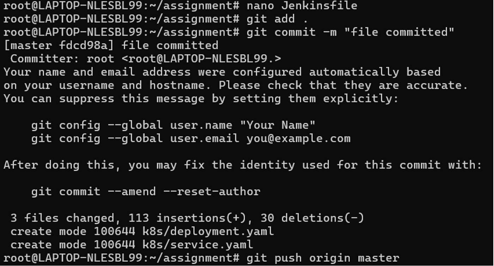
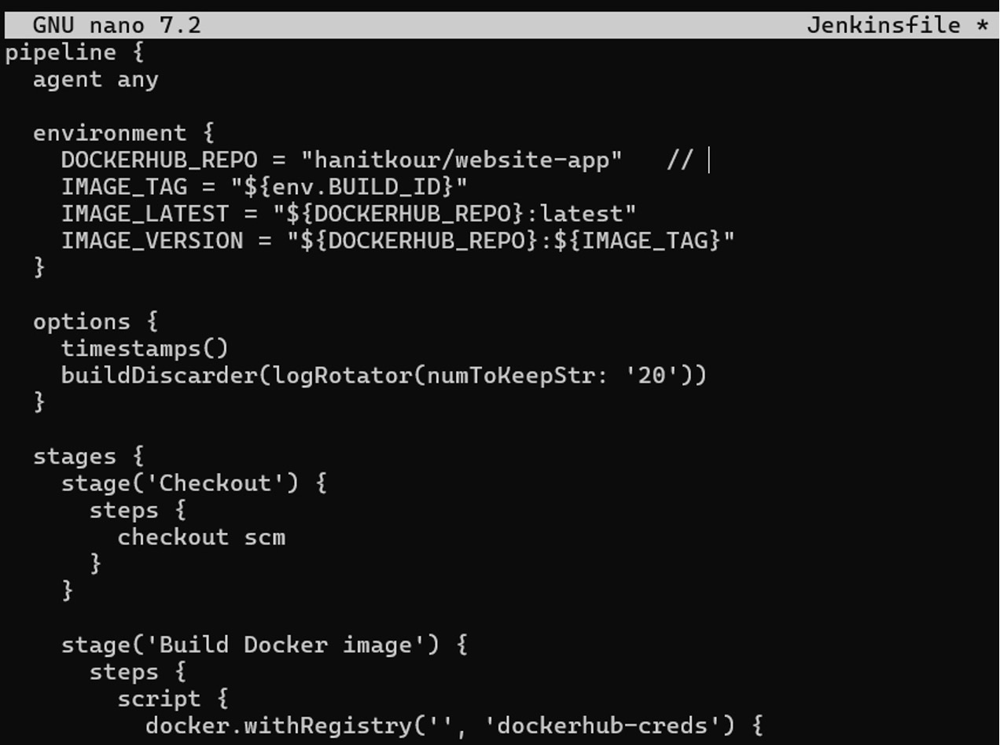
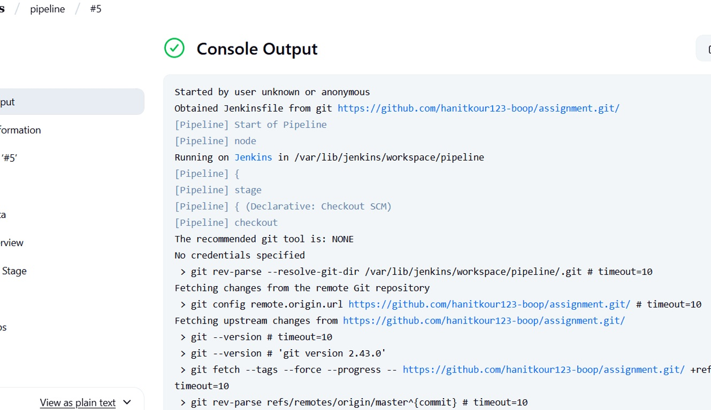

# Jenkins CI/CD Pipeline

Jenkins was used to automate the CI/CD workflow for the containerized application.

## Jenkinsfile Creation

A Jenkinsfile was created to define the pipeline stages and automate the required workflow.

## Jenkinsfile Configuration

The Jenkinsfile contained the pipeline configuration used for the DevOps workflow.

## Successful Pipeline Execution

The Jenkins pipeline was executed successfully, and the build console output confirmed successful execution.

