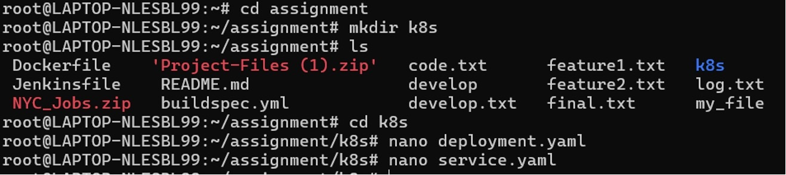
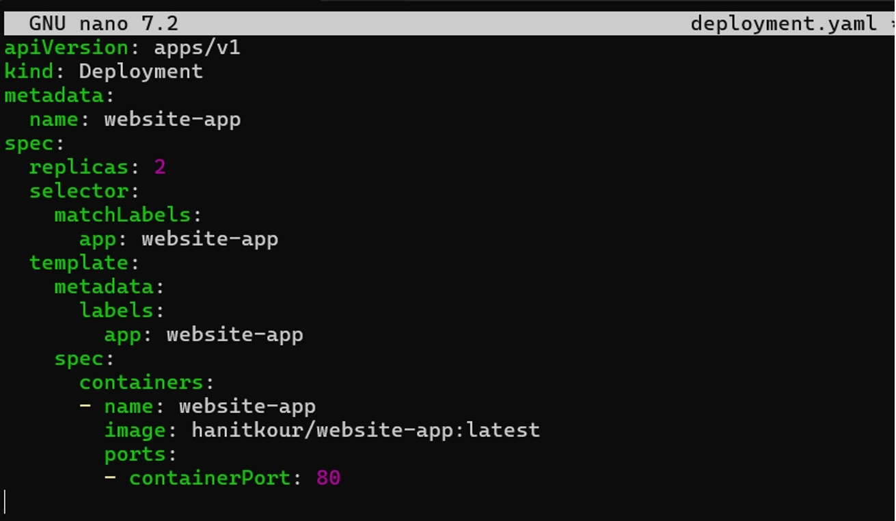
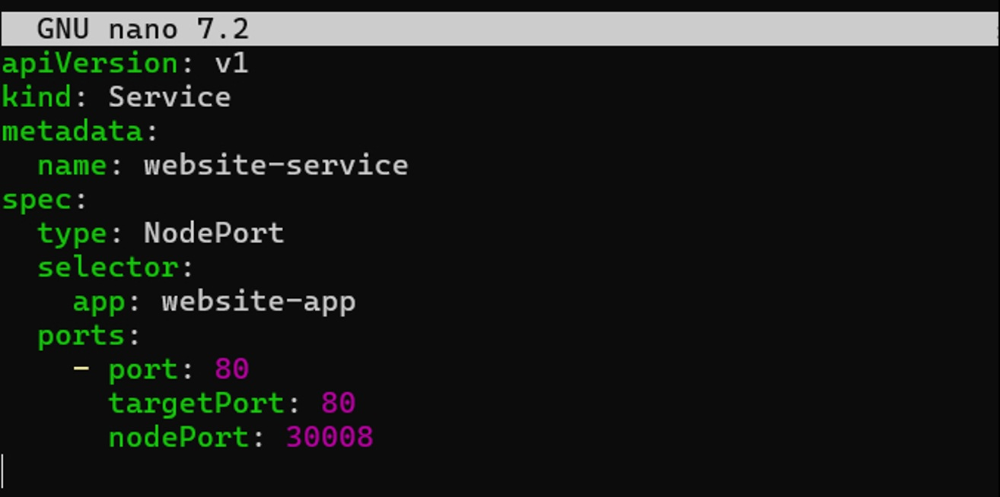
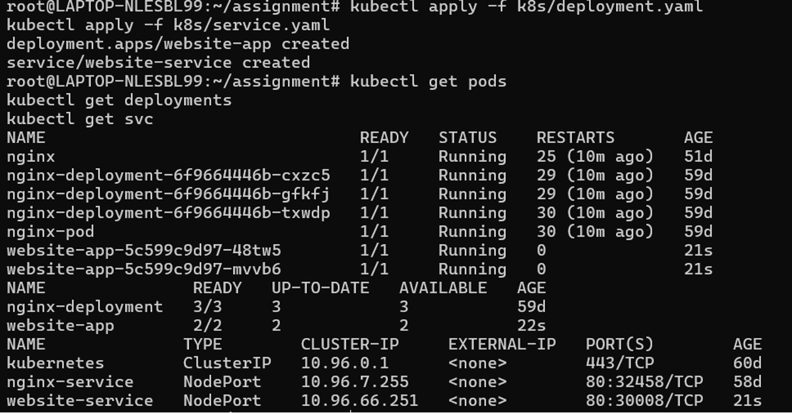

# Kubernetes Deployment

Kubernetes was used to deploy and manage the containerized application in the production environment.

The deployment used the custom Docker image stored in Docker Hub.

## Kubernetes Configuration

Deployment and Service YAML files were created for the application.

## Deployment Configuration

The Deployment YAML defined the application deployment and replica configuration.

## Service Configuration

A Kubernetes Service was configured to expose the application using a NodePort service.

## Running Application

The Kubernetes Deployment and Service were successfully applied to the cluster.

The `website-app` deployment was configured with **2 replicas**, and both pods were running successfully.

A **NodePort Service** was configured to expose the application on port **30008**.

