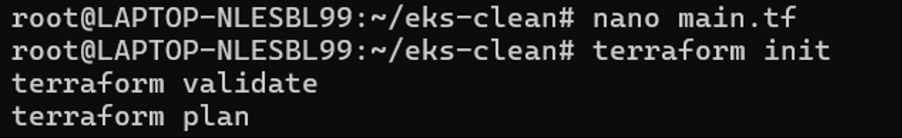
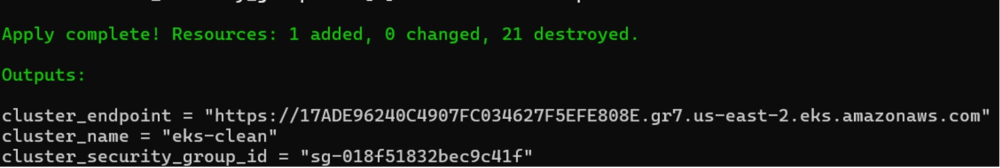
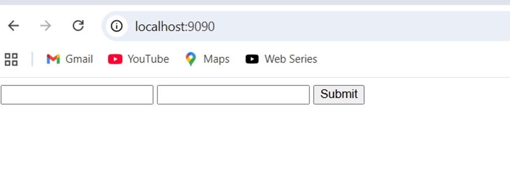
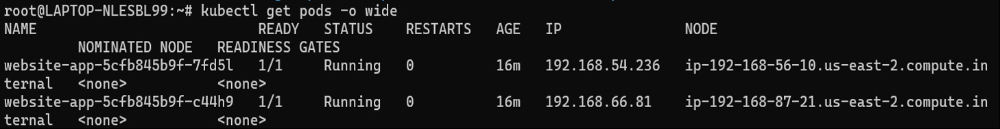
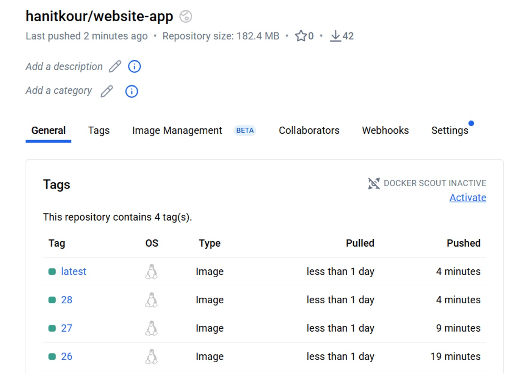

# Website Deployment on AWS

This section demonstrates the infrastructure provisioning and application deployment workflow used for the project.

## Terraform Infrastructure

Terraform was used to initialize, validate, and provision the required AWS infrastructure.

## Infrastructure Provisioning

The Terraform configuration was successfully applied to provision the required infrastructure.

## Application Deployment

The website application was deployed to the Kubernetes environment running on AWS.

## Application Running

The deployed website was successfully accessed and verified.

## Deployment Workflow

The overall deployment process involved:

**Terraform → AWS Infrastructure → EKS/Kubernetes → Docker Container → Website Application**
